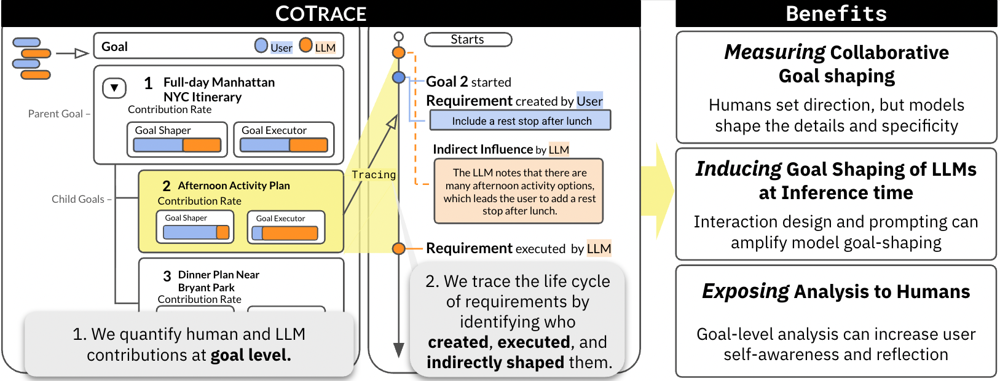

<div align="center">
  <h1>"I didn’t Make the Micro Decisions": Measuring, Inducing, and Exposing Goal-Level AI Contributions in Collaboration </h1>
  <h3></h3>
  <p>
    This is the official GitHub repository for "I didn’t Make the Micro Decisions": Measuring, Inducing, and Exposing Goal-Level AI Contributions in Collaboration.
  </p>
  <p>
    <a href="https://arxiv.org/abs/2605.21363"></a>
    <a href="https://rladmstn1714.github.io/CoTrace"></a>
    <!-- <a href="HF_LINK"></a> -->
    <!-- <a href="REPO_LINK"></a> -->
  </p>
</div>



---

## Overview

This repository contains the code for CoTrace pipeline, and interactive tool for the paper.


## Repository Structure

```text
.
├── tool/         # Interactive tool for exploring goal hierarchies and influence relations
├── pipeline/     # Core pipeline for goal extraction, requirement extraction, and influence labeling
└── README.md
```

## Citation
Please cite our paper if you use any part of this code in your work:
```text
@misc{kim2026cotrace,
      title={"I didn't Make the Micro Decisions": Measuring, Inducing, and Exposing Goal-Level AI Contributions in Collaboration}, 
      author={Eunsu Kim and Jessica R. Mindel and Kyungjin Kim and Sherry Tongshuang Wu},
      year={2026},
      eprint={2605.21363},
      archivePrefix={arXiv},
      primaryClass={cs.CL},
      url={https://arxiv.org/abs/2605.21363}, 
}
```

If you have any questions, please open a GitHub issue or contact us via email at [eunsukim@andrew.cmu.edu](mailto:eunsukim@andrew.cmu.edu).